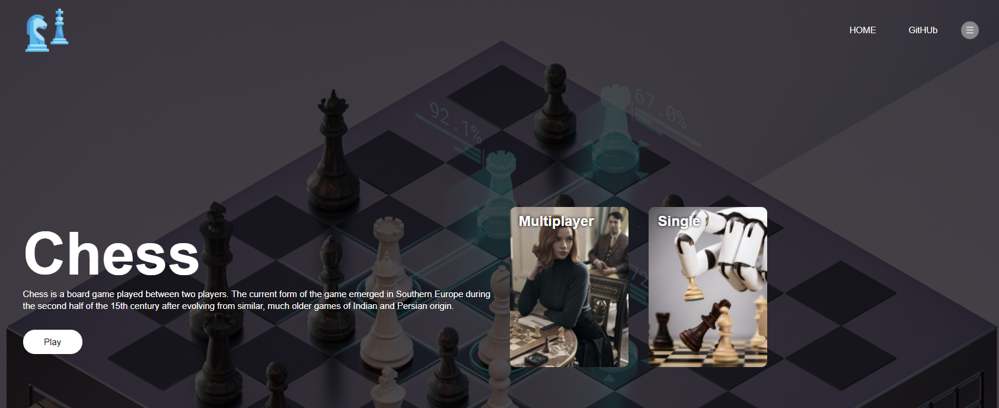

  
  
  <h1 align="center">Online Chess</h1>
  
 Single And Multiplayer Chess Game 

 

## What is Chess? 
Chess is a board game played between two players. The current form of the game emerged in Southern Europe during the second half of the 15th century after evolving from similar, much older games of Indian and Persian origin.

## Game Mode 
This Chess Game Have 2 Mode
- Single Where You can Play with AI
- Multiplayer Play with Your Friend

[Play]()
